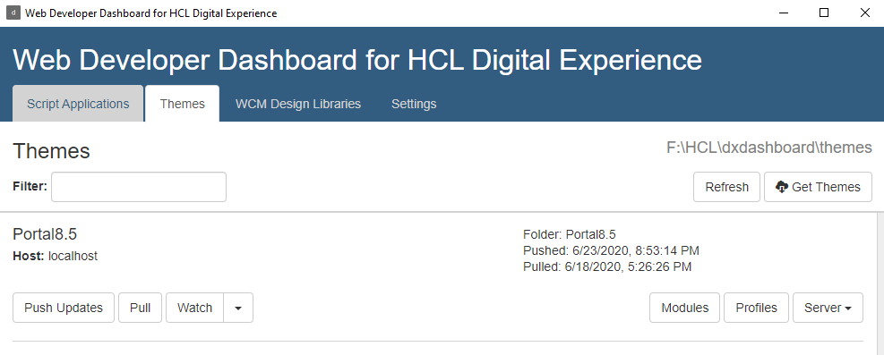
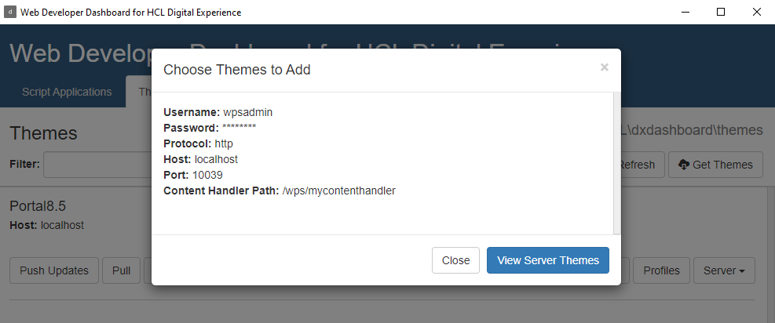
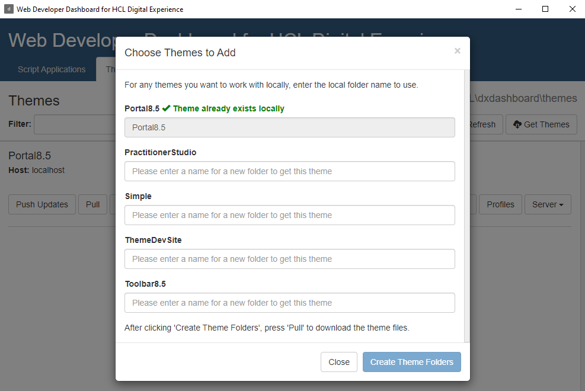
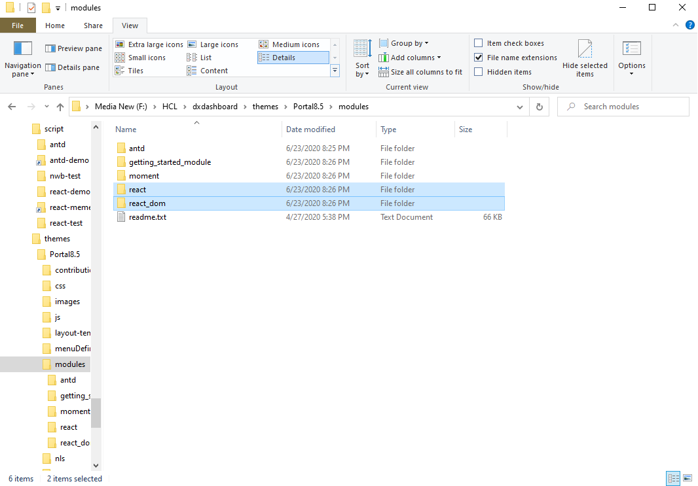
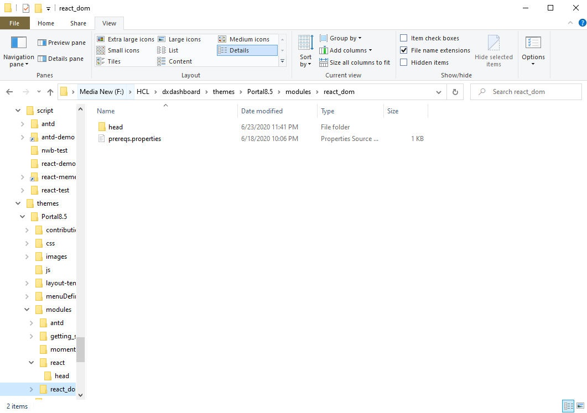
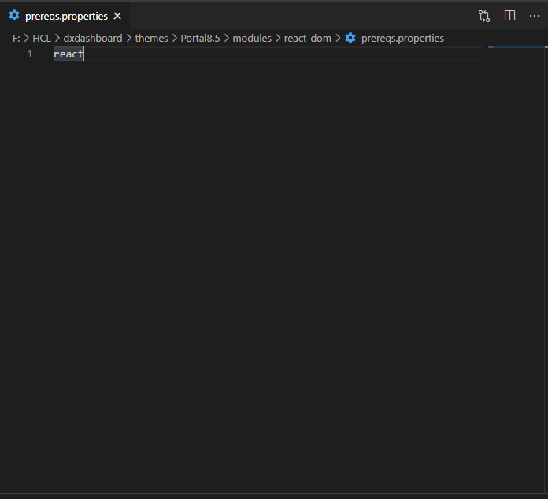
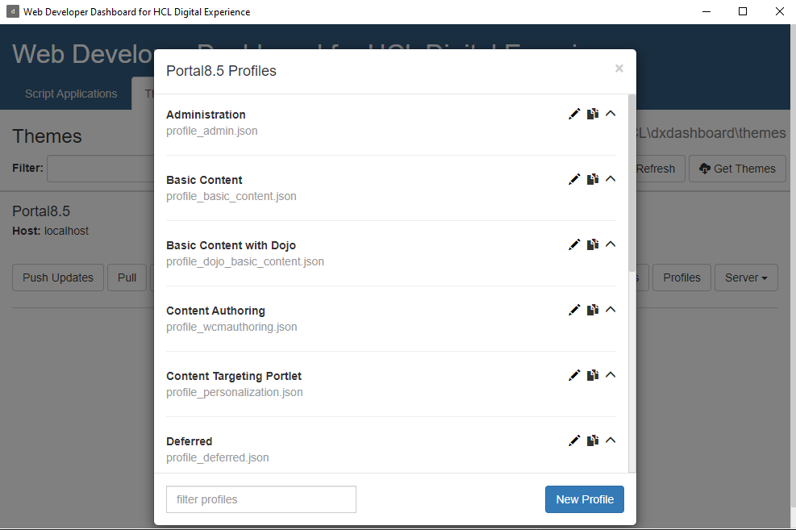
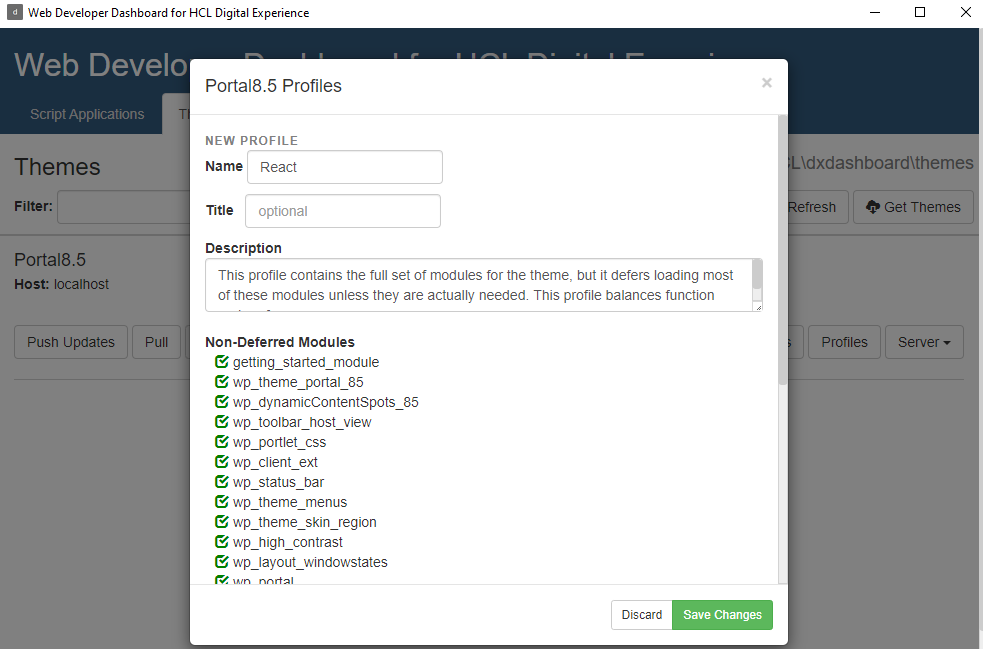
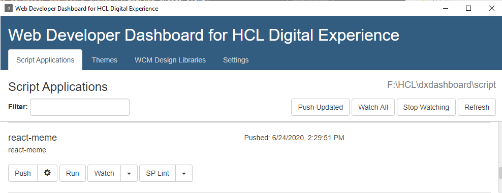

# HCL DX React Script App Example

## Overview
This example app shows how React can be used in Script App portlets. It uses DX modular themes aggregator capability to provide React and ReactDOM.

Webpack is used to package the React components and create a build folder. I am using Windows symbolic links to map the build folder to the Web Developer Dashboard. This would be the same approach on Linux or MacOS using ln instead of mklink.

The proect structure is as follows:

- **build**
    - _Output folder. Symlinked to the Web Deveopler Dashboard script folder location._
- **src**
    - **assets**
        - _Images etc._
    - **css**
        - _CSS Files_
    - **components**
        - _React Components_
    - sp-config.json < _HCL DX Web Developer Dashboard configuration_
    - vendor.js < _Load 3rd party libraries here_

Run `npm start` to start a local Webpack dev server. Alternatively you can use the run option in the HCL DX Web Developer Dashboard.

Run `npm run build` to build to the build folder. If the folder is linked into the script folder of the Dashoard and watch is enabled on the folder in the Dashboard, changes will be pushed into the configured DX server automatically. 

The example uses the HCL DX 9.5 docker container but any DX instance can be used. 

## Setup

1. Install Docker from the [Docker site](https://docs.docker.com/get-docker/)
2. Install [Node.js](https://nodejs.org/en/download/). See the version requirements for the DX Developer Dashboard.
3. These steps are only neccessary when using a local DX docker container. You can configure the Web Developer Dashboard with remote servers. Configure the settings appropriately.
    - Download the DX Docker container from [Flexnet](https://hclsoftware.flexnetoperations.com/flexnet/operationsportal/logon.do). 
    - Extract the large zip file and you will end up with multiple container packages
    - The largest container file is the core DX image. It will probably be named like hcl-dx-core-image-v95-xxxxxxxx-xxxx.tar.gz
    - Load the container into your local docker environment

        ```docker load < hcl-dx-core-image-v95-xxxxxxxx-xxxx.tar.gz```
    - You should now have a new image we can use:

        ```
        c:> docker images
        REPOSITORY      TAG                     IMAGE ID        CREATED SIZE
        ...
        hcl/dx/core     v95_CF18_20200427-2055  ae54e9f9f56a    8 weeks ago 17GB
        ...
        ```
    - To run the container you can use the docker-compose.yml file or run it with Docker run. By default the server will be at http://localhost:10039/wps/portal and the admin user and password are wpsadmin.
    - Since you will be making changes which require re-boots it is advisable to map a volume into the container. This way if you delete the container, you will not have to reapply the settings when creating new containers. You can see an example volume in the docker-compose.yml file.
    - For more information see the container documentation at the [HCL documentation](https://help.hcltechsw.com/digital-experience/9.5/install/rm_container_deployment.html), specifically on [docker deployments](https://help.hcltechsw.com/digital-experience/9.5/containerization/docker.html).

4. Install the [DX Web Developer Dashboard](https://github.com/hcl-dx/WebDevDashboardForDx) and it's requirements and run it.
    - Configure script, theme and wcm folders in the settings to somewhere on your drive. I use a folder that includes sub folders for each and point to them.
    - Configure server(s).

        **_Example:_**

          Name:             Dashboard
          User Name:        wpsadmin
          Password:         wpsadmin
          Host:             localhost
          Port:             10039
          Content Handler:  /wps/mycontenthandler

    
5. Turn off dynamic parameter tag and shortform in DX since they may intefer with some of the syntax you will use with React. . 
    - Go to the Websphere Application Server Integrated Solution Console at https://localhost:10041/ibm/console
    - Set (or create) both the dynamic.parameter.tag.enabled and the renderingplugin.shortform.enabled resource environment provider values of the WCM WCMConfigService service to false in the HCL Digital Experience Integrated Solutions Console.
    - Make sure to restart the WebSphere_Portal server after these updates.
    
6. Clone this project somewhere on your drive
7. Run npm install at the root of the project to install Babel and its dependencies.
8. Create a symbolic link to the build folder from the scripts directory
    
    **_Windows:_**
    - Click the Start button
    - Type CMD in the Start Search box
    - Press and hold down [Ctrl]+[Shift]+[Enter] to start in administrator mode
    - Run the mklink command.
      
      ```mklink /D C:\HCL\dxdashboard\script\react-meme C:\HCL\dxdashboard\dev\react-meme\build```
9. Run `npm run build` to build to the build folder. If the folder is linked into the script folder of the Dashoard and watch is enabled on the folder in the Dashboard, changes will be pushed into the configured DX server automatically. 
10. Add React and ReactDOM to the theme you want to use - here we will use the default Portal 8.5 Theme.
    - In the DX Web Developer Dashboard go to Themes and hit Get Themes. (The images show an already configured setup) 
    
    - You may see a screen with a **_Get Server Themes option_**, click that button.
    
    - The Dashboard will show you all themes on the server you may use. Supply a name for the folder where you want to store the theme assets in under the Portal 8.5 theme.
    
    - Click **_Create Theme Folders_** 
    - The dashboard will now pull all the theme assets to the folder you specified.
    - Go to the theme folder and into the **_modules_** sub folder
    - Create two new folders in the **_modules_** sub folder named **_react_** and **_react_dom_**
    
    - Within each of the new folders, create a head folder.
    - Download the React and ReactDom minified javascript files and copy them into the respective head folders.
    
    - Create a file named **_prereqs.properties_** in the **_react_dom_** folder and add **_react_** as a dependency.
    
    VS Code:
    
    - Go back to the dashboard and go to Themes and click the Profiles button for the Portal 8.5 theme.
    
    - Copy the **_Deferred_** profile, name it **_React_** and add the **_react_** and **_react_dom_** modules.
    
    - Save your change and push the updates to the theme to the server.
    - In the DX Web Developer Dashboard go to Script Applications and hit refresh. Since you linked the build folder into the scripts folder in step 8, you should now see the react-meme application.
    - Script Applications are stored as content in the CMS, and the sp-config.json file in the src folder configures the DX Web Developer Dashboard appropriately. See the documentation on [command line push support](https://help.hcltechsw.com/digital-experience/8.5/script-portlet/cmd_line_push_cmd.html) for more information.
    - You can now push the application to the server using the push option.
    
    - Create a new page in DX and choose the React profile for it in the advanced page settings. You should see the react-meme application listed under Script Applications. Add it to the page and exit edit mode.
    
    - Edit the code, click watch in the Web Developer Dashboard and run `npm run build`. If you have watch enabled in the Developer Dashboard, changes will be synchronized to the server.
    
**Notes:**

You can edit the scrip application on the portal server, but since we are  a packager/minifier, you may want to change the webpack.prod.js file before debugging inside DX. Change:

    mode: "production",
    
to
    
    mode: "development",
    devtool: "none",

and remove the `optimization:` section.


## Attribution
The portlet app code is based on the freeCodeCap.org React course on [youTube](https://youtu.be/DLX62G4lc44). Check it out if you are new to React since it gives a great introduction to core React concepts.


